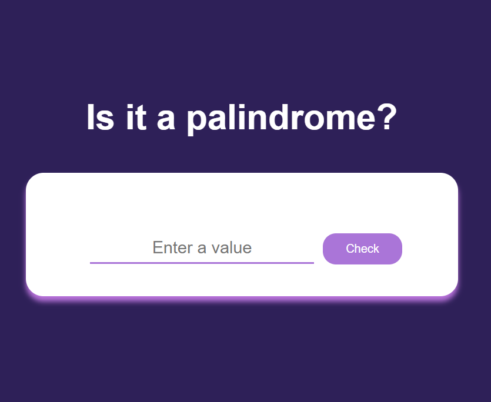

# Palindrome Checker

This little project consists of a simple web page that checks if a text string is a palindrome. Verification is done by clicking a button.

A palindrome is a word or sentence that's spelled the same way both forward and backward, ignoring punctuation, case, and spacing.





## Used

- HTML Structure
- JavaScript Code
- CSS
## Funcionamiento del Código

- Capture the button click event with id `check-btn`.
- Call the `checkInputValue()` function to check if the text string is a palindrome.
- The `checkInputValue()` function obtains the value of the input field and performs the following actions:
  - Shows an alert if the field is empty.
  - Removes non-alphanumeric characters and converts the string to lowercase.
  - Compares the original string with its inverted version to determine if it is a palindrome.
  - Display the result in the element with the id `result`.

## Run Locally

Clone the project

```bash
  git clone https://github.com/Meybe-1in/palindrome.git
```

Go to the project directory

```bash
  cd palindrome
```

- Open the `index.html` file in your web browser.
- Enter a text string in the input field.
- Click the "Check" button.
- Observe the result in the result section.
